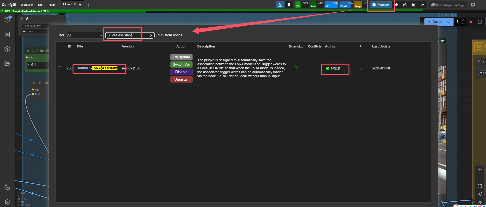
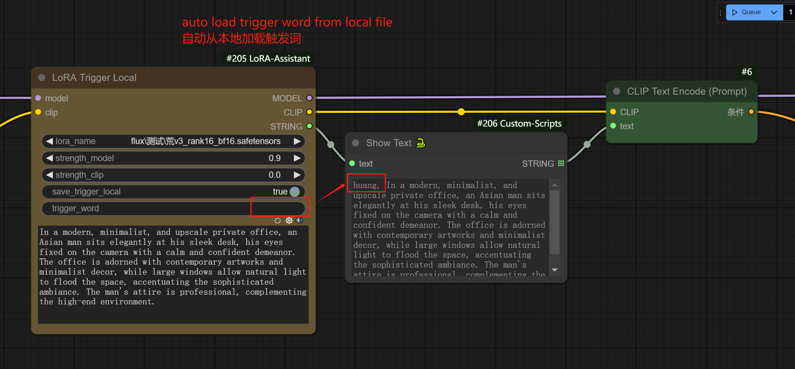
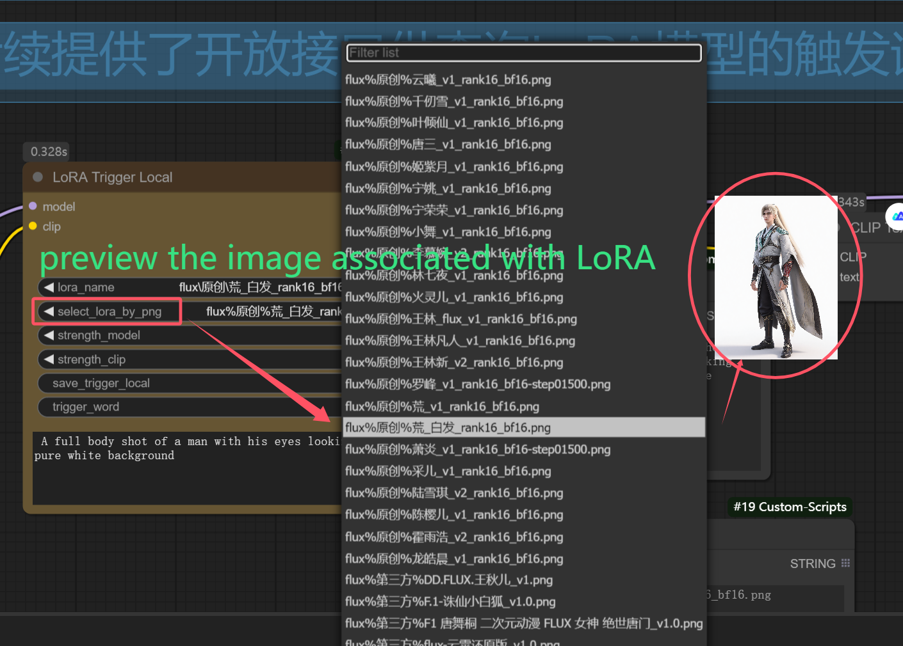

# ComfyUI-LoRA-Assistant

## Introduction 简介
The plug-in is designed to automatically save the association between the LoRA model and Trigger words to a Local JSON file so that when the LoRA model is loaded, the associated trigger words can be automatically loaded via the node "LoRA Trigger Local" without manual input.

该插件旨在自动将LoRA模型和触发词之间的关联关系保存到本地JSON文件中，以便在加载LoRA模型时，可以通过节点“LoRA Trigger Local”自动加载关联的触发词，无需手动输入。

It can now preview the images associated with LoRA as well.

它现在也可以预览LoRA关联的图像了。

## Installation 安装
### Install by ComfyUI Manager（Recommend） 通过ComfyUI管理器安装(推荐)

### Manual installation 手动安装
1. Go to comfyUI custom_nodes folder, `ComfyUI/custom_nodes/` 打开Comfyui插件目录
2. git clone https://github.com/Bellzs/ComfyUI-LoRA-Assistant.git 克隆此仓库
### To preview the Lora-related images, please install the required Custom Node.预览LoRA图像的必要插件
- （Optional）If you want to preview LoRA-related images, please install the required plugin [ComfyUI_Custom_Nodes_AlekPet](https://github.com/AlekPet/ComfyUI_Custom_Nodes_AlekPet).
- 如果你希望能预览LoRA相关的图像，请安装必要的插件[ComfyUI_Custom_Nodes_AlekPet](https://github.com/AlekPet/ComfyUI_Custom_Nodes_AlekPet)

## Usage 使用教程
### LoRA Trigger Local节点

#### select_lora_by_png
- You can preview the image associated with LoRA by this list (provided that the [ComfyUI_Custom_Nodes_AlekPet](https://github.com/AlekPet/ComfyUI_Custom_Nodes_AlekPet) plugin is installed). When you select a PNG image, the 'lora_name' will be updated synchronously. These images should be set to the names displayed in the list and placed in the 'input' folder.
- 您可以通过这个列表预览与LoRA相关的图像（前提是安装了[ComfyUI_Custom_Nodes_AlekPet](https://github.com/AlekPet/ComfyUI_Custom_Nodes_AlekPet)插件）。当您选择PNG图像时，'lora_name'将同步更新。这些图像应设置为列表中显示的名称，并放置在'input'文件夹中。
#### save_trigger_local
- When 'trigger_word' is not empty, whether it is set to the trigger word of this lora so that the trigger word is loaded automatically later.After saving, you can still modify the LoRA file name, which does not affect the association with the trigger word.
- 当‘trigger_word’不为空时，是否将其设置为该LoRA的触发词，以便后续自动加载触发词。保存后，你依然可以修改LoRA文件名，这并不影响与触发词的关联关系。
#### trigger_word
- Manually set the trigger word. If it is empty, the last saved trigger word is automatically loaded.
- 手动设置触发词。如果为空，则自动加载上次保存的触发词。
#### positive_prompt
- The positive prompt other than the trigger word, if it is not empty, is automatically concated with the trigger word to form the final text output.
- 除触发词外的正面提示词，若它不为空，则将自动与触发词拼接成最后的文本输出内容。

## Todo 后续开发计划
- [ ] Automatically sync LoRA information from LibLib. 自动从LibLib中同步LoRA信息。
- [x] Preview the images associated with LoRA. 预览LoRA关联的图片。
- [x] Save the trigger word set by the user, and realize the automatic reading of the trigger word when using LoRA in the future. 保存用户设置的触发词，以后使用LoRA时实现自动读取触发词。

## Acknowledgments 致谢
Thanks to the LoadLoraWithTags plugin author, I learned some of its code logic when developing this plugin.
感谢LoadLoraWithTags插件作者，我在开发本插件时借鉴了它的部分代码逻辑：
[LoadLoraWithTags](https://github.com/Extraltodeus/LoadLoraWithTags)

## Submit an issue if you have a good suggestion 如果你有好的建议，可提交issue

