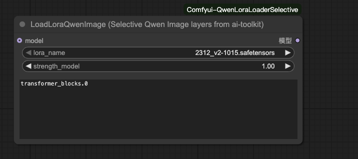

# LoadLoraQwenImage (Selective Qwen Image layers from ai-toolkit)

`LoadLoraQwenImage` is a ComfyUI custom node for Qwen Image Edit pipelines. It selectively applies Qwen Image edit LoRAs to specific UNet transformer layers based on keyword filters, keeping the rest of the network untouched for precise control.

---

## Feature Overview

- 🎯 **Layer-level control** – Match target transformer layers via the `layer_filter` keyword list (e.g. `transformer_blocks.0`). You can control the layers of Lora applications.
- 🔒 **Exclude specific layers** – Use `exclude_filter` to explicitly block layers from being patched. This is applied after `layer_filter` and takes precedence when both are provided.
- 🧩 **Qwen Image Edit friendly** – Optimized for ai-toolkit Qwen Image edit LoRAs and compatible with existing workflows.

---

## Inputs & Outputs

| Name | Type | Description |
|------|------|-------------|
| `model` | MODEL (optional) | Diffusion model to be patched. Connect the output of a Qwen Image checkpoint loader or another upstream node. |
| `lora_name` | Combo | LoRA file from `ComfyUI/models/loras`. |
| `strength_model` | FLOAT | Scaling factor for the injected LoRA. Supports negative values; default is 1.0. |
| `layer_filter` | STRING (multiline) | Optional comma/newline separated keywords to match target weight paths. Leave empty to apply to all available layers. |
| `exclude_filter` | STRING (multiline) | Optional comma/newline separated keywords to exclude matched layers (e.g. `attn`, `transformer_blocks.1`). Applied after `layer_filter`; when both are set, exclusion wins. |

Output:

- `model` – The model patched with the selected LoRA. Attach it to samplers or downstream nodes.

---

## Usage Scope

- **Recommended** – Qwen Image Edit / Qwen Image-VL LoRAs, especially ai-toolkit releases focused on instruction or style edits.
- **Compatible** – Any LoRA that follows Stable Diffusion / SDXL naming conventions, as long as the layer names match.
### Qwen Image Model Notes

Qwen Image and Qwen Image Edit UNet backbones contain **60 transformer blocks**, indexed from `transformer_blocks.0` through `transformer_blocks.59`. When you populate `layer_filter`, you can point at any subset of these blocks—for example:

```text
transformer_blocks.0,
transformer_blocks.5,
transformer_blocks.0, transformer_blocks.12
```

Leave the filter empty to apply the LoRA to all available transformer layers.

#### Include vs Exclude

- `layer_filter` selects a candidate set (leave empty to select all).
- `exclude_filter` removes any candidates whose names contain the given tokens.
- If both are provided, exclusion takes precedence.
---

## How to Use

1. Copy `Comfyui-QwenLoraLoaderSelective` into `ComfyUI/custom_nodes`.
2. Launch ComfyUI. The node appears under **loaders** as **LoadLoraQwenImage (Selective Qwen Image layers from ai-toolkit)**.
3. In your workflow:
		1. Connect the upstream MODEL output (e.g. from `Checkpoint Loader (Qwen Image)`).
	2. Pick a Qwen LoRA file from `lora_name`.
	3. Enter layer keywords in `layer_filter`, for example:

		```text
		transformer_blocks.0
		cross_attention
		```
	3b. Optionally, add `exclude_filter` to block certain layers even if included above, for example:

		```text
		attn,
		transformer_blocks.1
		```

	4. Tune `strength_model` like any standard LoRA node.
4. Feed the resulting model into a sampler (`KSampler`, etc.) to continue your editing pipeline.

Example：




### Example Workflow

```text
Checkpoint Loader (Qwen Image) → LoadLoraQwenImage → KSampler → VAE Decode → Save Image
```

Using `layer_filter = transformer_blocks.0` limits the LoRA to the first transformer block, enabling fine-grained adjustments to localized styles or directives.


## Troubleshooting

- **LoRA not applied** – Verify that `layer_filter` hits valid layer names. Leave it empty to test global coverage.
- **Nothing changes with both filters** – If using `exclude_filter` together with `layer_filter`, ensure they don’t cancel each other out (e.g. excluding everything). Try clearing `exclude_filter` first.
- **Loading error** – Ensure the LoRA resides in `models/loras` and targets a Qwen Image-compatible architecture. If logs show missing keys, refine the filter keywords.

---

## License

MIT License. Please respect the individual licenses of LoRA assets you deploy.

> **Note**: The node has been validated with LoRAs trained via the ai-toolkit training framework. LoRAs produced by other toolchains may not be compatible—please test them on your own setup. If you encounter issues, feel free to open an issue for assistance.
